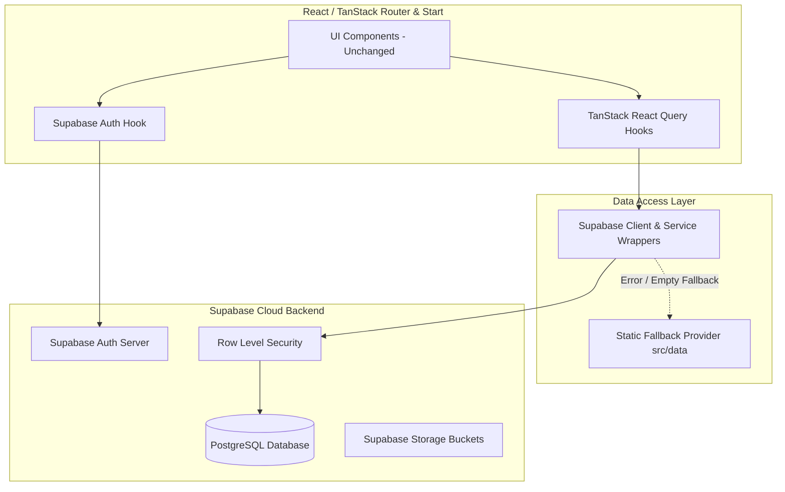

# Supabase Backend & Dynamic Data Integration Plan

## Executive Overview
This document outlines a phased strategy for integrating **Supabase Cloud** (Database, Authentication, Storage, and Realtime) into the **SVIT College Website** codebase. 

> [!IMPORTANT]
> **Strict Constraint**: Zero UI/UX, styling, layout, micro-animation, or CSS changes will be made. All visual components will remain 100% identical. The data layer will be updated seamlessly underneath to fetch dynamic data from Supabase Cloud with fallback mechanisms to local static mock data (`src/data/*`).

---

## Architecture Blueprint



---

## Phase 1: Environment & Client Configuration

1. **Environment Variables**:
   - Verify credentials in `.env`:
     - `VITE_SUPABASE_URL`
     - `VITE_SUPABASE_PUBLISHABLE_KEY` (or `VITE_SUPABASE_ANON_KEY`)
     - `SUPABASE_SERVICE_ROLE_KEY` (if server-side actions/SSR require admin operations)
2. **Client Validation**:
   - Verify `src/integrations/supabase/client.ts` for browser query initialization.
   - Verify `src/integrations/supabase/client.server.ts` for TanStack Start SSR context.
3. **Database Types Generation**:
   - Run Supabase CLI type generation to keep `src/integrations/supabase/types.ts` strictly synchronized with the database schema:
     ```bash
     npx supabase gen types typescript --project-id <PROJECT_ID> > src/integrations/supabase/types.ts
     ```

---

## Phase 2: Database Schema & Migration Execution

1. **Run Fixed Migration Script**:
   - Apply `migration1.sql` (which creates 40+ tables including `colleges`, `departments`, `courses`, `staff_profiles`, `posts`, `events`, `homepage_items`, `recruiters`, `placement_statistics`, etc.).
2. **Apply Row Level Security (RLS) Policies**:
   - **Public Read Access**: Enable `SELECT` for `anon` and `authenticated` roles on all published content tables (`status = 'published'`).
   - **Authenticated Write Access**: Restrict `INSERT`, `UPDATE`, `DELETE` to admin/staff roles or user-specific records.
   - **Inquiry Submissions**: Allow `INSERT` for `anon` on `inquiry_submissions` to support public contact/inquiry forms.
3. **Seed Initial Data**:
   - Seed core records into Supabase Cloud using `supabase/migrations/20260718080249_4a64dcdf-165d-43a5-8ef5-8ee98aab660e.sql` and data extracted from `src/data/*.ts`.

---

## Phase 3: Data Access Layer & Custom Query Hooks

Create clean React Query hooks under `src/hooks/useSupabaseData.ts` that interface with `@supabase/supabase-js`. Each hook automatically falls back to local static data (`src/data/*`) if Supabase is offline or returns empty records.

### Hook Inventory & Mapping Table

| Entity / Section | Custom Hook Name | Primary Supabase Table | Static Fallback Source |
| :--- | :--- | :--- | :--- |
| **Homepage Content** | `useHomepageItems(itemType)` | `public.homepage_items` | `src/data/heroHighlights.ts` |
| **Colleges List & Detail** | `useColleges()`, `useCollege(slug)` | `public.colleges` | `src/data/colleges.ts` |
| **Departments** | `useDepartments()`, `useDepartment(slug)` | `public.departments` | `src/data/departmentContent.ts` |
| **Courses & Programs** | `useCourses()`, `useCourse(code)` | `public.courses` | `src/data/academics.ts`, `programDetails.ts` |
| **Faculty & Staff Directory** | `useStaffProfiles()`, `useStaffProfile(id)` | `public.staff_profiles` | `src/data/staff.ts` |
| **Events & News** | `useEvents()`, `usePosts()` | `public.events`, `public.posts` | `src/data/campus-rfe.ts` |
| **Recruiters & Placement** | `useRecruiters()`, `usePlacementStats()` | `public.recruiters`, `public.placement_statistics` | `src/data/placement.ts` |
| **Downloads & Notices** | `useDownloads()` | `public.downloads` | `src/data/campus-rfe.ts` |
| **Form Submissions** | `useSubmitInquiry()`, `useSubmitGrievance()` | `public.inquiry_submissions` | Local Toast notification |

---

## Phase 4: Authentication & Session Management Integration

1. **Supabase Auth Integration**:
   - Connect `src/routes/student-login.tsx` to `supabase.auth.signInWithPassword()` / `signUp()`.
   - Maintain authentication state using a lightweight `useAuth()` React Context wrapper around `supabase.auth.onAuthStateChange()`.
2. **User Profile Trigger Verification**:
   - Confirm `handle_new_user()` trigger auto-populates `public.user_profiles` when a user completes auth registration.
3. **Protected Routes Middleware**:
   - Wire `auth-middleware.ts` into TanStack Start loaders for protected dashboard routes.

---

## Phase 5: Route-by-Route Integration Execution

Integration will proceed phase-by-phase across page components:

### 5.1 Homepage (`src/routes/index.tsx`)
- Bind Hero banner, stats counter, quick links, and highlight cards to `useHomepageItems()`.
- Bind Recruiter logos slider to `useRecruiters()`.
- Bind Upcoming Events & Latest News cards to `useEvents()` and `usePosts()`.

### 5.2 Academics & Departments (`src/routes/courses.*.tsx`, `departments.*.tsx`)
- Bind Course cards, degree levels, and syllabi to `useCourses()`.
- Bind Department details, HOD message, labs, and achievements to `useDepartments()`.

### 5.3 Faculty & Staff Directory (`src/routes/staff.*.tsx`)
- Bind Faculty grid, designations, qualifications, research interests, and publications to `useStaffProfiles()`.

### 5.4 Campus Life, News & Downloads (`src/routes/campus-life.*.tsx`, `downloads.tsx`)
- Bind Facilities, Student Clubs, Gallery Albums, Downloads list, and News/Events archives to Supabase queries.

### 5.5 Forms & Inquiries (`src/routes/admissions.inquiry.tsx`, `contact.tsx`, `grievance.tsx`)
- Connect form submissions directly to `inquiry_submissions` table mutations with instant feedback via Sonner toasts.

---

## Phase 6: Quality Assurance & Fallback Validation

1. **Zero-UI Regression Check**:
   - Verify every page visually against baseline designs to ensure 0% layout shift or styling variation.
2. **Offline & Graceful Fallback Test**:
   - Test application behavior when database tables are empty or network is throttled to verify fallback to `src/data/*.ts`.
3. **Data Integrity & Type Safety**:
   - Validate TypeScript types across all API payloads and route loaders.

---

## Next Steps

> [!NOTE]
> Once you provide the Supabase Cloud project credentials, we will initiate **Phase 1** (configuring `.env` & testing connection) and proceed step-by-step according to this roadmap.
